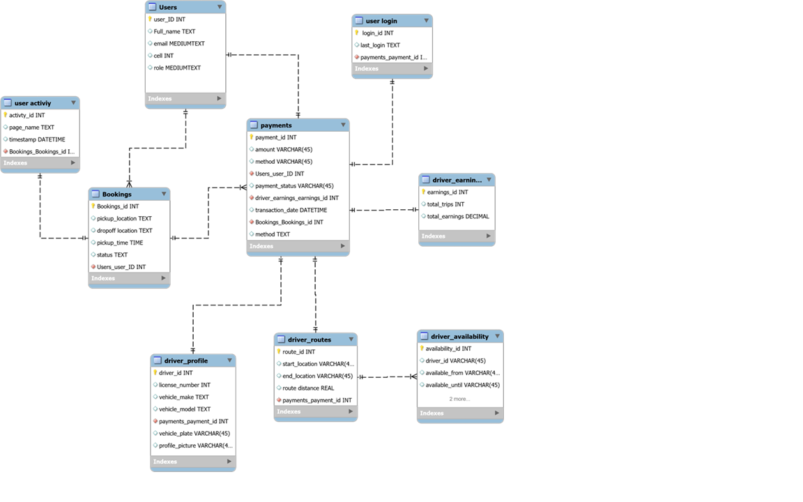

1.Project Purpose

The purpose of this project is to improve the efficiency, reliability, and safety of rural and long-distance taxi transport in South Africa by developing a web-based system that connects commuters with taxi operators. The system will reduce passenger waiting times, enhance route coordination system, enable real-time communication, support digital bookings and payments as well as verify authorized taxi operators. By doing so, the project seeks to increase commuter satisfaction, improve driver productivity, and strengthen the overall supply chain performance in rural communities.

2. Data Base Schema code

CREATE TABLE IF NOT EXISTS users (
    user_id INTEGER PRIMARY KEY AUTOINCREMENT,
    full_name TEXT NOT NULL,
    email TEXT NOT NULL UNIQUE,
    phone TEXT,
    password TEXT NOT NULL,
    role TEXT NOT NULL DEFAULT 'Passenger' CHECK(role IN ('Passenger','Driver','Admin')),
    date_created TEXT NOT NULL DEFAULT (datetime('now'))
);

CREATE TABLE IF NOT EXISTS user_login (
    login_id INTEGER PRIMARY KEY AUTOINCREMENT,
    user_id INTEGER NOT NULL,
    last_login TEXT DEFAULT NULL,
    FOREIGN KEY (user_id) REFERENCES users(user_id) ON DELETE CASCADE
);

CREATE TABLE IF NOT EXISTS bookings (
    booking_id INTEGER PRIMARY KEY AUTOINCREMENT,
    user_id INTEGER NOT NULL,
    pickup_location TEXT NOT NULL,
    dropoff_location TEXT NOT NULL,
    pickup_time TEXT,
    distance_km REAL,
    estimated_fare REAL,
    status TEXT NOT NULL DEFAULT 'Pending' CHECK(status IN ('Pending','Accepted','Completed','Cancelled')),
    booking_date TEXT NOT NULL DEFAULT (datetime('now')),
    FOREIGN KEY (user_id) REFERENCES users(user_id) ON DELETE CASCADE
);

CREATE TABLE IF NOT EXISTS driver_availability (
    availability_id INTEGER PRIMARY KEY AUTOINCREMENT,
    driver_id INTEGER NOT NULL,
    available_from TEXT,
    available_until TEXT,
    current_location TEXT,
    status TEXT NOT NULL DEFAULT 'Available' CHECK(status IN ('Available','Unavailable')),
    FOREIGN KEY (driver_id) REFERENCES users(user_id) ON DELETE CASCADE
);

CREATE TABLE IF NOT EXISTS payments (
    payment_id INTEGER PRIMARY KEY AUTOINCREMENT,
    booking_id INTEGER NOT NULL,
    user_id INTEGER NOT NULL,
    amount REAL NOT NULL,
    method TEXT NOT NULL DEFAULT 'Cash' CHECK(method IN ('Cash','Card','Wallet','Other')),
    payment_status TEXT NOT NULL DEFAULT 'Pending' CHECK(payment_status IN ('Pending','Paid','Failed')),
    transaction_date TEXT NOT NULL DEFAULT (datetime('now')),
    FOREIGN KEY (booking_id) REFERENCES bookings(booking_id) ON DELETE CASCADE,
    FOREIGN KEY (user_id) REFERENCES users(user_id) ON DELETE CASCADE
);

CREATE TABLE IF NOT EXISTS driver_profile (
    driver_id INTEGER PRIMARY KEY,
    license_number TEXT,
    vehicle_make TEXT,
    vehicle_model TEXT,
    vehicle_plate TEXT,
    profile_picture TEXT,
    rating REAL DEFAULT 0.00,
    FOREIGN KEY (driver_id) REFERENCES users(user_id) ON DELETE CASCADE
);

CREATE TABLE IF NOT EXISTS driver_routes (
    route_id INTEGER PRIMARY KEY AUTOINCREMENT,
    driver_id INTEGER NOT NULL,
    start_location TEXT,
    end_location TEXT,
    route_distance_km REAL,
    trip_time_estimate TEXT,
    FOREIGN KEY (driver_id) REFERENCES users(user_id) ON DELETE CASCADE
);

CREATE TABLE IF NOT EXISTS driver_earnings (
    earning_id INTEGER PRIMARY KEY AUTOINCREMENT,
    driver_id INTEGER NOT NULL,
    total_trips INTEGER DEFAULT 0,
    total_earnings REAL DEFAULT 0.00,
    last_payment_date TEXT,
    FOREIGN KEY (driver_id) REFERENCES users(user_id) ON DELETE CASCADE
);

CREATE TABLE IF NOT EXISTS user_activity (
    activity_id INTEGER PRIMARY KEY AUTOINCREMENT,
    user_id INTEGER NOT NULL,
    page_name TEXT,
    action_description TEXT,
    timestamp TEXT NOT NULL DEFAULT (datetime('now')),
    FOREIGN KEY (user_id) REFERENCES users(user_id) ON DELETE CASCADE
);

3 ERD

4. Steps on how to run the project
1. Project Initiation
•	Define project scope, objectives, and deliverables based on the problem statement.
•	Identify the stakeholders involved: taxi drivers, commuters, local transport authorities, and technical team.
•	Develop a high-level timeline (using a Gannt chart), budget, and resource plan.

2. Requirements Gathering
•	Conduct interviews with commuters and taxi operators to understand their struggling points.
•	Document functional requirements such as a booking system, GPS tracking, digital payment.
•	Document non-functional requirements (e.g. safety verification, reliability and accessibility)

3. System Design
•	Create wireframes using Figma for webpages, booking interface, and dashboards.
•	Plan GPS integration for route tracking and real-time updates.
•	Design digital payment integration and safety verification process.
4. Development
•	Develop core modules:
1.	User registration and login
2.	Online booking system
3.	GPS tracking and route monitoring
4.	Digital payment system
5.	Driver verification module
•	Conduct iterative testing for each module.
5. Testing
•	 Ensure all modules work together seamlessly.
•	Address bugs and feedback.

6. Deployment
•	Launch the web-based platform in a controlled environment (e.g. selected rural areas or taxi routes).
•	Train taxi drivers and commuter representatives on how to use the system.
•	Promote the platform to attract commuters and ensure adoption.

7. Monitoring and Evaluation
•	Monitor KPIs:
-Average trip lead time
-Booking success rate
-Average commuter waiting time
-Safety incident reports
-Percentage of successful online payments
•	Collect user feedback for improvements.
•	Adjust routes, booking policies, and system features based on real-world usage.

8. Maintenance and Continuous Improvement
•	Regularly update the system to improve features and enhance security.
•	Continuously analyse data to optimize routes, reduce waiting times to improve service efficiency.

